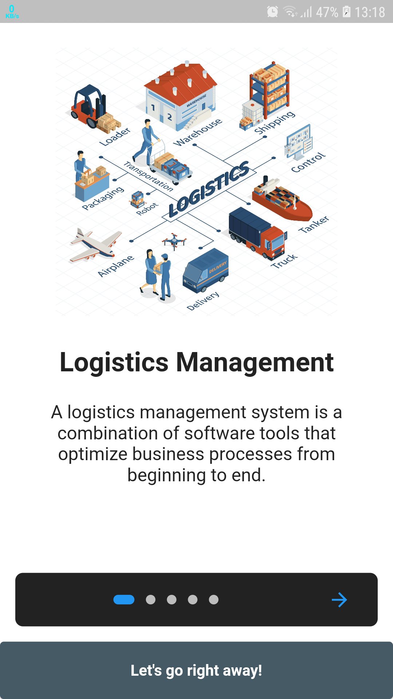
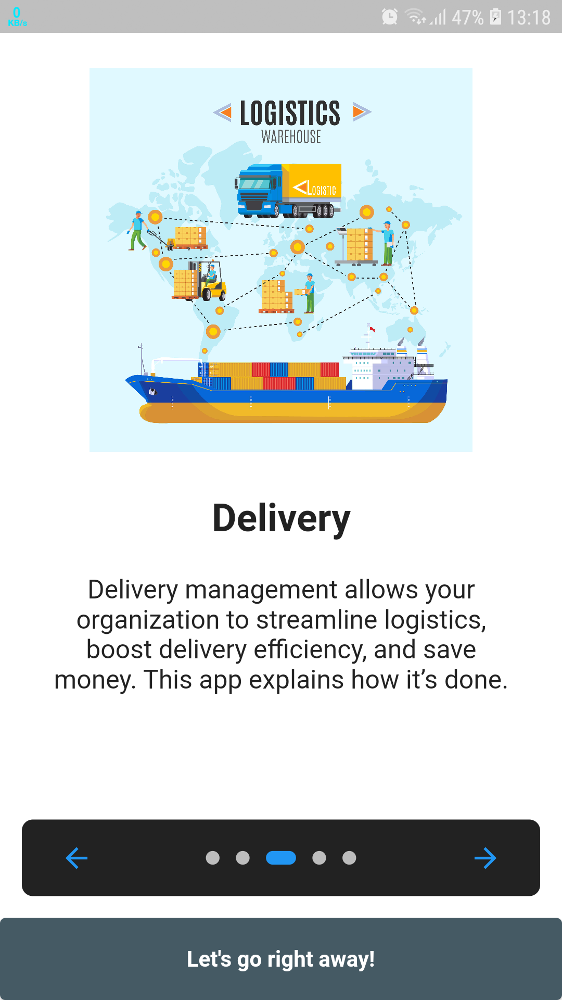
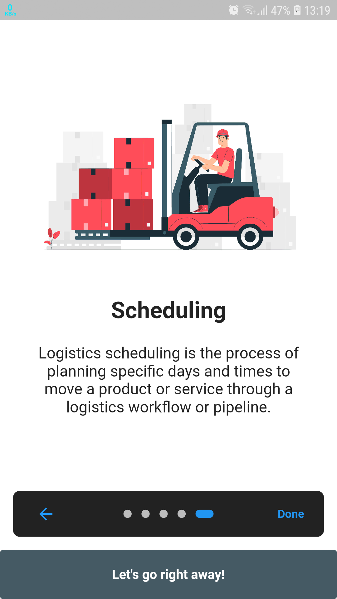
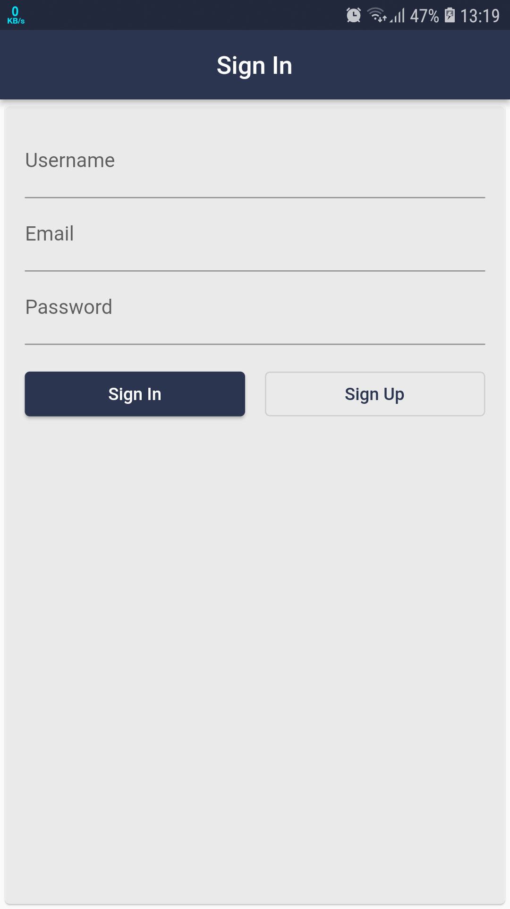
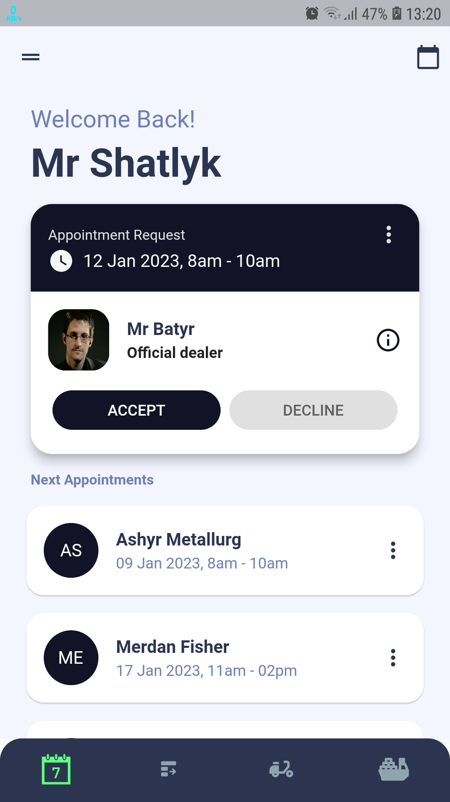
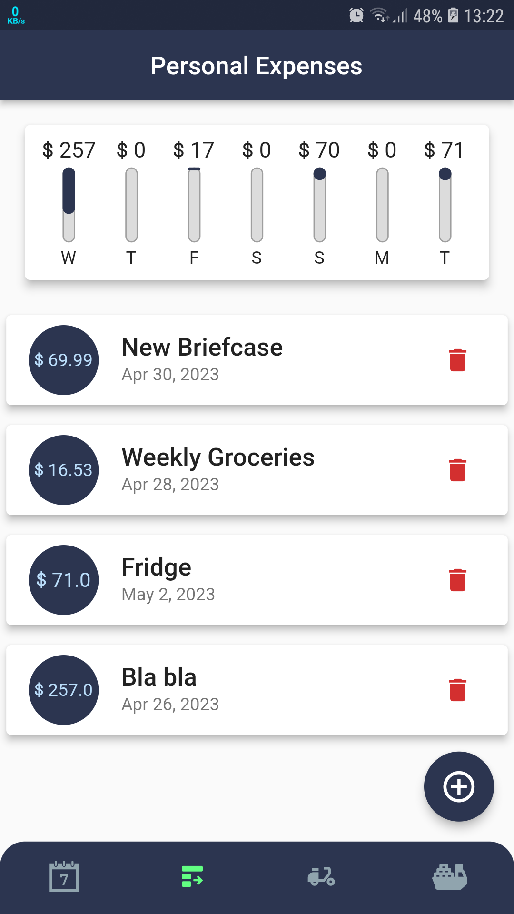
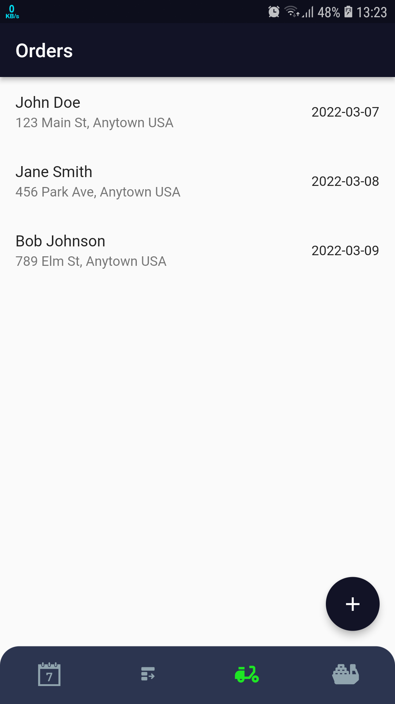
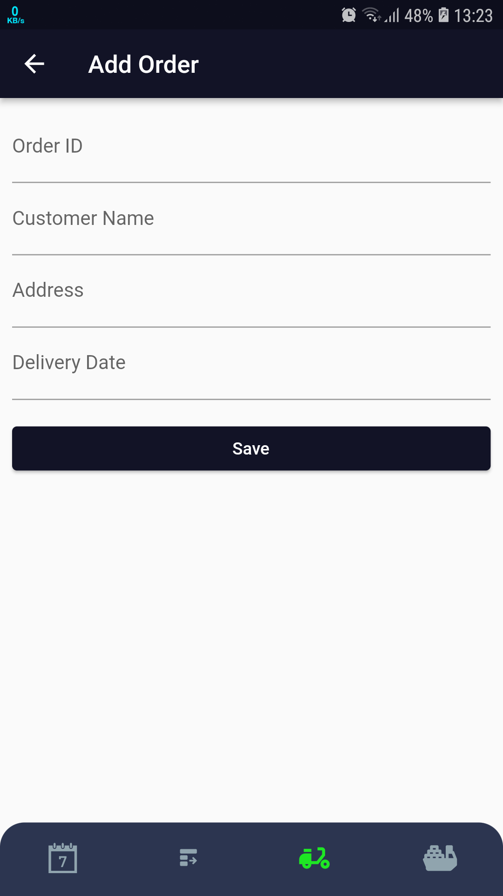
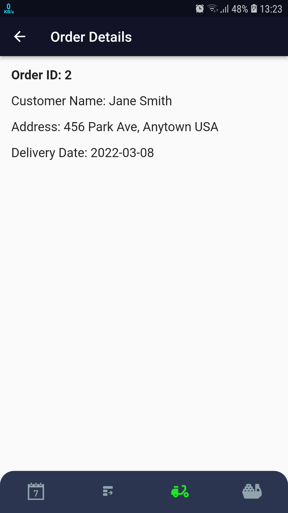

# logistics-management

Welcome to my Logistics Management System app, one of my simple projects that I've done. This application helps streamline various logistics processes, including appointment scheduling, personal expenses tracking, order management, and shipping/cargo information. 

## Screenshots














## Getting Started

To run the app locally, follow these steps:

1. Clone the repository:

    ```bash
    git clone https://github.com/shatlyk-jr/e-nano-dict
    ```

2. Navigate to the project directory:

    ```bash
    cd e-nano-dict
    ```

3. Install dependencies:

    ```bash
    flutter pub get
    ```

4. Run the app:

    ```bash
    flutter run
    ```

## Features

### Appointments Screen

The Appointments screen displays scheduled appointments, providing an organized view of upcoming logistics events.

### Personal Expenses Screen

In the Personal Expenses screen, users can add and track items for sale or purchase, including price information.

### Ordering Functionality Pages

- **Order History:** View a comprehensive history of past orders.
- **Order Details:** Access detailed information about each order.
- **Adding Order:** Easily add new orders with relevant details.

### Shipping and Cargo Page

Track shipping and cargo information, ensuring smooth logistics operations.

## Usage

Explore the different sections of the app to manage appointments, track personal expenses, handle orders, and monitor shipping and cargo details.


